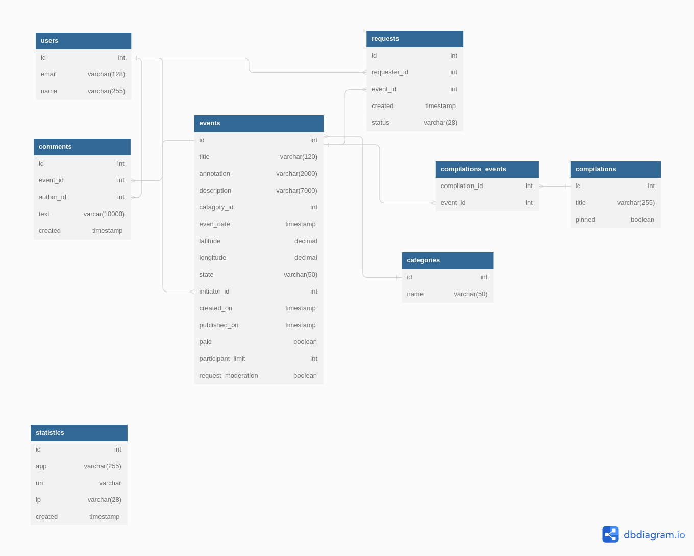

## Учебное приложение "Explore with me" на основе микросервисной архитектуры

### Стек технологий:
Java SE, Spring Boot, Hibernate, PostgreSQL, Maven, Docker, Lombok, Jackson

### Функциональность
Предоставляет возможность делиться информацией об интересных событиях и помогать найти компанию для участия в них 
Своеобразная афиша, где можно предложить какое-либо событие от выставки до похода в кино и набрать компанию
для участия в нём

### Структура
Два сервиса:
* основной сервис содержит всё необходимое для работы продукта
* cервис статистики хранит количество просмотров и позволяет делать различные выборки
  для анализа работы приложения

У каждого сервиса своя база данных (Postgresql 42.5.0), взаимодействие сервисов организовано через RestTemplate

### Запуск:
* требуется установленные Docker (при разработке использовалась версия 3.8) и Docker Compose
* в корневой папке проекта открыть терминал и выполнить команду 'docker-compose up'

Порядок запуска сервисов и баз данных:
* stats-db (база данных сервера статистики)
* stats-server (сервер статистики)
* emv-db (база данных основного сервиса)
* emv-service (основной сервис)

### Визуализация результатов работы
Коллекции тестов Postman:
* [основной сервис - ewm-main-service.json](https://github.com/Evgeny2835/Explore-with-me/blob/main/postman/ewm-main-service.json)
* [сервис статистики - ewm-stat-service.json](https://github.com/Evgeny2835/Explore-with-me/blob/main/postman/ewm-stat-service.json)

### ER диаграмма

### Основной сервис
Три части (публичная, закрытая, административная)

Публичный API предоставляет возможности поиска и фильтрации событий:
* сортировка списка событий организована по количеству просмотров (запрашивается в сервисе статистики)
* при просмотре списка событий возвращается только краткая информация о мероприятиях
* просмотр подробной информации о конкретном событии настроен через отдельный эндпоинт
* предусмотрена возможность получения всех имеющихся категорий и подборок событий (такие подборки должны составлять
  администраторы ресурса)
* каждый публичный запрос для получения списка событий или полной информации о мероприятии фиксируется
  сервисом статистики

Закрытая часть API реализует возможности зарегистрированных пользователей продукта:
* авторизованные пользователи имеют возможность добавлять в приложение новые мероприятия, редактировать их и
  просматривать после добавления
* настроена подача заявок на участие в интересующих мероприятиях
* создатель мероприятия имеет возможность подтверждать заявки, которые отправили другие пользователи сервиса

Административная часть API предоставляет возможности настройки и поддержки работы сервиса:
* настроено добавление, изменение и удаление категорий для событий
* имеется возможность добавлять, удалять и закреплять на главной странице подборки мероприятий
* предусмотрена модерация событий, размещённых пользователями (публикация или отклонение)
* настроено управление пользователями (добавление, просмотр, удаление)

### Сервис статистики
Реализует задачу сбора информации, на основе которой формируется статистика о работе приложения:
* о количестве обращений пользователей к спискам событий
* о количестве запросов к подробной информации о событии

### Подробная спецификация API:
* [основной сервис - ewm-main-service-spec.json](https://github.com/Evgeny2835/Explore-with-me/blob/main/ewm-main-service-spec.json)
* [сервис статистики - ewm-stats-service-spec.json](https://github.com/Evgeny2835/Explore-with-me/blob/main/ewm-stats-service-spec.json)

Для просмотра файлов используйте редактор, например [Swagger](https://editor-next.swagger.io/)

### Аутентификация и авторизация
Не реализовано 
Предполагается, что с внешним миром приложение связывается через отдельный сервис, который контактирует
с системой аутентификации и авторизации, а затем перенаправляет запросы в сервисы 
В настоящее время считается, что поступление запроса к закрытой или административной части API означает,
что запрос успешно прошел аутентификацию и авторизацию
